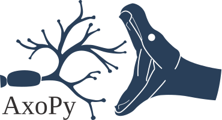

|

.. image:: https://travis-ci.org/ucdrascal/axopy.svg?branch=master
    :target: https://travis-ci.org/ucdrascal/axopy
    :alt: Travis CI Status

.. image:: https://readthedocs.org/projects/axopy/badge/?version=latest
   :target: http://axopy.readthedocs.io/en/latest/?badge=latest
   :alt: Documentation Status

|

Axo-Pythonic synapses are those in which an axon synapses upon a Python
program. AxoPy aims to facilitate such connections between electrophysiolgical
signals and machines.
